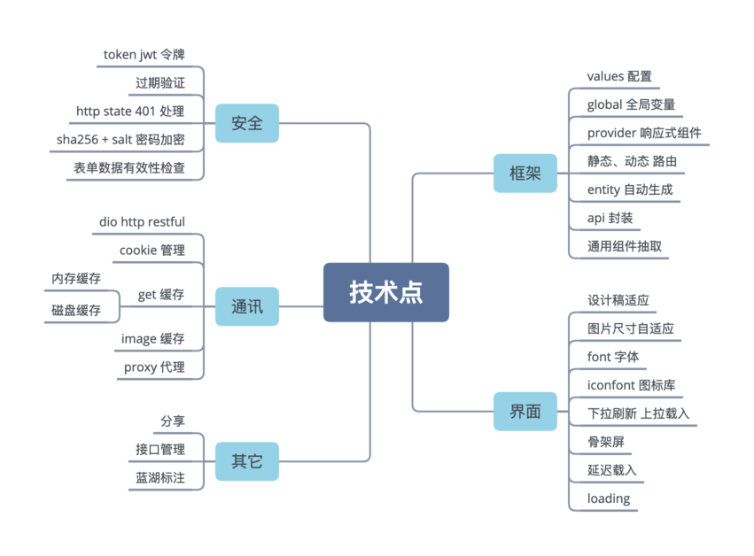
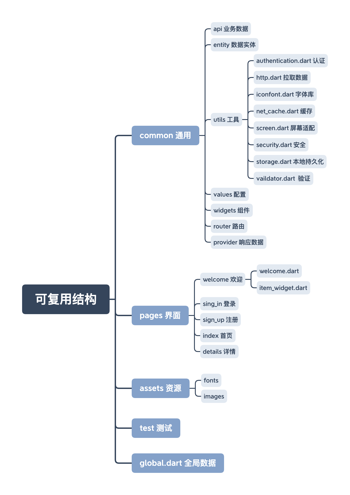

# Flutter 新闻客户端


## 仓库地址

- https://gitee.com/ducafecat/flutter_learn_news

- https://github.com/ducafecat/flutter_learn_news

## 导航

- [客户端 flutter + yapi](https://github.com/ducafecat/flutter_learn_news)
- [客户端 flutter + strapi + graphql](https://github.com/ducafecat/flutter_learn_news/tree/graphql+strapi)
- [客户端后台 docker + strapi + eggjs + mongo + redis](https://github.com/ducafecat/flutter_ducafecat_news_backend)

## 项目目标

通过新闻 APP 业务构建一套精简的代码模板。

## SDK 环境

```
Flutter 1.17.2 • channel stable • https://github.com/flutter/flutter.git
Framework • revision 5f21edf8b6 (4 days ago) • 2020-05-28 12:44:12 -0700
Engine • revision b851c71829
Tools • Dart 2.8.3
```

## 功能

- [x] 欢迎界面
- [x] 登录界面
- [x] 注册界面
- [x] 首页
- [ ] 分类页
- [ ] 搜索页
- [x] 详情页
- [x] 个人中心

## 文档 + 视频

| 文档                                                                                                                                                       | B 站                                                 | 油管                                                                                                      |
| ---------------------------------------------------------------------------------------------------------------------------------------------------------- | ---------------------------------------------------- | --------------------------------------------------------------------------------------------------------- |
| [01 需求分析、使用蓝湖标注工具、项目目录构建](https://ducafecat.tech/2020/02/26/flutter-project/flutter-project-news-01-setup/)                            | [视频](https://www.bilibili.com/video/BV1J7411N7KF)  | [视频](https://www.youtube.com/watch?v=Uucg6GGGBsY&list=PL274L1n86T80VZR30KaLOKV6jqwTq5E8D&index=2&t=2s)  |
| [02 设计稿适配、加入图片字体资源、欢迎界面](https://ducafecat.tech/2020/02/27/flutter-project/flutter-project-news-02-weclome/)                            | [视频](https://www.bilibili.com/video/BV19E411s7YM)  | [视频](https://www.youtube.com/watch?v=equsSqqwl9E&list=PL274L1n86T80VZR30KaLOKV6jqwTq5E8D&index=3&t=0s)  |
| [03 静态路由、组件抽取、登录注册界面](https://ducafecat.tech/2020/03/12/flutter-project/flutter-project-news-03-sign-in-up/)                               | [视频](https://www.bilibili.com/video/BV1rE411G7se)  | [视频](https://www.youtube.com/watch?v=rF1KYE_QJWU&list=PL274L1n86T80VZR30KaLOKV6jqwTq5E8D&index=4&t=0s)  |
| [04 YAPI 接口管理、RESTful、生成代码、dio 封装](https://ducafecat.tech/2020/03/16/flutter-project/flutter-project-news-04-entity-http/)                    | [视频](https://www.bilibili.com/video/BV1t7411R7tN)  | [视频](https://www.youtube.com/watch?v=tj3QZjchIzU&list=PL274L1n86T80VZR30KaLOKV6jqwTq5E8D&index=5&t=0s)  |
| [05 AppData、Cache、Fiddle、iconfont、主界面搭建](https://ducafecat.tech/2020/03/25/flutter-project/flutter-project-news-05-cache-iconfont/)               | [视频](https://www.bilibili.com/video/BV1A54y1d7Pa)  | [视频](https://www.youtube.com/watch?v=JSSaEQZ5u_c&list=PL274L1n86T80VZR30KaLOKV6jqwTq5E8D&index=6&t=0s)  |
| [06 代码规范、业务代码组织、新闻首页实现](https://ducafecat.tech/2020/03/31/flutter-project/flutter-project-news-06-main-ui/)                              | [视频](https://www.bilibili.com/video/BV1Pp4y1C7hx)  | [视频](https://www.youtube.com/watch?v=cc5aeI2q6lg&list=PL274L1n86T80VZR30KaLOKV6jqwTq5E8D&index=7&t=0s)  |
| [07 Provider、认证授权、骨架屏、磁盘缓存](https://ducafecat.tech/2020/04/08/flutter-project/flutter-project-news-07-provider/)                             | [视频](https://www.bilibili.com/video/BV1vV411o7bn)  | [视频](https://www.youtube.com/watch?v=-hup_quZ0K4&list=PL274L1n86T80VZR30KaLOKV6jqwTq5E8D&index=8&t=0s)  |
|                                                                                                                                                            | [视频](https://www.bilibili.com/video/BV1SA411t7ov)  | [视频](https://www.youtube.com/watch?v=lYSFtcq4b7k&list=PL274L1n86T80VZR30KaLOKV6jqwTq5E8D&index=9&t=0s)  |
|                                                                                                                                                            | [视频](https://www.bilibili.com/video/BV1jt4y1U7Nn)  | [视频](https://www.youtube.com/watch?v=w7wxUEDs7V8&list=PL274L1n86T80VZR30KaLOKV6jqwTq5E8D&index=10&t=0s) |
|                                                                                                                                                            | [视频](https://www.bilibili.com/video/BV1wt4y127L5)  | [视频](https://www.youtube.com/watch?v=Qit7IqBUlCE&list=PL274L1n86T80VZR30KaLOKV6jqwTq5E8D&index=11&t=0s) |
|                                                                                                                                                            | [视频](https://www.bilibili.com/video/BV1b54y1d7DB)  | [视频](https://www.youtube.com/watch?v=87iZgxpgpVQ&list=PL274L1n86T80VZR30KaLOKV6jqwTq5E8D&index=12&t=0s) |
|                                                                                                                                                            | [视频](https://www.bilibili.com/video/BV11z411b7FJ)  | [视频](https://www.youtube.com/watch?v=8V7aIu0adic&list=PL274L1n86T80VZR30KaLOKV6jqwTq5E8D&index=13&t=0s) |
| [08 路由管理 auto_route](https://ducafecat.tech/2020/04/17/flutter-project/flutter-project-news-08-auto-route/)                                            | [视频](https://www.bilibili.com/video/BV1xf4y1S7Xq)  | [视频](https://www.youtube.com/watch?v=tuCBD2mUhV4&list=PL274L1n86T80VZR30KaLOKV6jqwTq5E8D&index=14&t=0s) |
| [09 详情页展示、分享、远程真机调试](https://ducafecat.tech/2020/04/24/flutter-project/flutter-project-news-09-webview/)                                    | [视频](https://www.bilibili.com/video/BV18e411s7A1)  | [视频](https://www.youtube.com/watch?v=HwLqjMYvT5c&list=PL274L1n86T80VZR30KaLOKV6jqwTq5E8D&index=15&t=0s) |
|                                                                                                                                                            | [视频](https://www.bilibili.com/video/BV1RZ4y1W7CN)  | [视频](https://www.youtube.com/watch?v=GKZBp8yU7Ro&list=PL274L1n86T80VZR30KaLOKV6jqwTq5E8D&index=16&t=0s) |
| [10 编译发布正式版](https://ducafecat.tech/2020/05/05/flutter-project/flutter-project-news-10-release/)                                                    | [视频](https://www.bilibili.com/video/BV1G541147ZV)  | [视频](https://www.youtube.com/watch?v=0AQU15NbgqQ&list=PL274L1n86T80VZR30KaLOKV6jqwTq5E8D&index=17&t=0s) |
|                                                                                                                                                            | [视频](https://www.bilibili.com/video/BV1ik4y1k7yP)  | [视频](https://www.youtube.com/watch?v=mJrH9A70YwU&list=PL274L1n86T80VZR30KaLOKV6jqwTq5E8D&index=18&t=0s) |
| [11 APP 升级、android 动态授权](https://ducafecat.tech/2020/05/16/flutter-project/flutter-project-news-11-update-permission/)                              | [视频](https://www.bilibili.com/video/BV1Gi4y147zG)  | [视频](https://www.youtube.com/watch?v=USJKMKBS0QM&list=PL274L1n86T80VZR30KaLOKV6jqwTq5E8D&index=19&t=0s) |
|                                                                                                                                                            | [视频](https://www.bilibili.com/video/BV17t4y117ua)  | [视频](https://www.youtube.com/watch?v=fupPGExoMvo&list=PL274L1n86T80VZR30KaLOKV6jqwTq5E8D&index=20&t=0s) |
| [12 采用 sentry 平台收集错误](https://ducafecat.tech/2020/06/05/flutter-project/flutter-project-news-12-error-sentry/)                                     | [视频](https://www.bilibili.com/video/BV1Ek4y1r7zk)  | [视频](https://www.youtube.com/watch?v=BzE-vQCrak0&list=PL274L1n86T80VZR30KaLOKV6jqwTq5E8D&index=21&t=0s) |
| [13 使用 supernova 导入 adobe xd 自动生成用户中心代码](https://ducafecat.tech/2020/06/18/flutter-project/flutter-project-news-13-code-generate-supernova/) | [视频](https://www.bilibili.com/video/BV1t5411W7Tt)  | [视频](https://www.youtube.com/watch?v=ySDsQUb6kmE&list=PL274L1n86T80VZR30KaLOKV6jqwTq5E8D&index=21)      |
| [14 headless strapi + graphql 快速构建新闻后台](https://ducafecat.tech/2020/07/03/flutter-project/flutter-project-news-14-headless-strapi-graphql/)        | [视频](https://www.bilibili.com/video/BV1Zz411e7dj)  | [视频](https://www.youtube.com/watch?v=3ad-TZ6U3-E)                                                       |
| [15 strapi 数据建模 graphql 条件查询排序](https://ducafecat.tech/2020/07/09/flutter-project/flutter-project-news-15-strapi-graphql-data-model/)            | [视频](https://www.bilibili.com/video/BV1jD4y1S7Mu)  | [视频](https://youtu.be/OZSsRKMTCO4)                                                                      |
| [16 strapi + graphql 用户注册、登录、异常处理](https://ducafecat.tech/2020/07/14/flutter-project/flutter-project-news-16-strapi-graphql-login-register/)   | [视频](https://www.bilibili.com/video/BV1vt4y1Q7i3)  | [视频](https://youtu.be/Kpvlb5s3R5w)                                                                      |
| [17 strapi centos 发布部署 + jmeter 压测](https://ducafecat.tech/2020/07/21/flutter-project/flutter-project-news-17-strapi-docker-compose-deploy-jmeter/)  | [视频](https://www.bilibili.com/video/BV15v411q7CK/) | [视频](https://youtu.be/i-YQIpu9WOU)                                                                      |

## 技术点



## 目录结构



## dependencies 依赖包

| 名称                 | 说明         |
| -------------------- | ------------ |
| auto_route           | 路由管理     |
| intl                 | 日期格式     |
| flutter_screenutil   | 屏幕适配     |
| flutter_easyrefresh  | 上下拉刷新   |
| pk_skeleton          | 骨架屏       |
| fluttertoast         | 提示 toast   |
| dio                  | 通讯 http    |
| cookie_jar           | cookie       |
| dio_cookie_manager   | dio cookie   |
| shared_preferences   | 本地存储     |
| cached_network_image | 图片缓存     |
| crypto               | 加密 SHA     |
| provider             | 响应数据     |
| webview_flutter      | web 显示     |
| loading_animations   | loading 动画 |
| share                | 分享         |
| auto_route_generator | 自动路由     |
| build_runner         | 路由代码生成 |

## 导入 iconfont 图标库

```
iconfont_builder --from ./assets/fonts --to ./lib/common/utils/iconfont.dart
```

## 生成路由

```
flutter packages pub run build_runner build
```

## 代码仓

https://github.com/ducafecat/flutter_learn_news

## 接口管理

- 管理
  http://yapi.demo.qunar.com/

- 接口地址
  http://yapi.demo.qunar.com/mock/88171

## 蓝湖设计稿

https://lanhuapp.com/url/lYuz1

密码: gSKl

> 由于设计稿有版权，不方便提供下载，需要的联系我微信添加蓝湖授权

## 视频

- [B 站](https://space.bilibili.com/404904528/channel/detail?cid=106755)
- [油管镜像](https://www.youtube.com/watch?v=Uucg6GGGBsY&list=PL274L1n86T80VZR30KaLOKV6jqwTq5E8D)

## 联系

微信号: ducafecat
